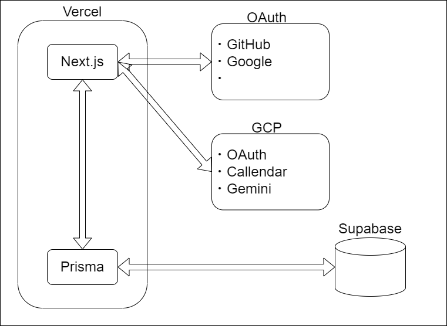

# 設計書
1. [アーキテクチャ/使用技術](#アーキテクチャ使用技術)
2. [仕様/設計](#仕様設計)
   1. [ダッシュボード(ホームページ)](#ダッシュボードホームページ)
      1. [概要](#概要)
      2. [詳細](#詳細)
   2. [ログイン画面](#ログイン画面)
      1. [概要](#概要-1)
      2. [詳細](#詳細-1)
   3. [日記アプリページ](#日記アプリページ)
      1. [概要](#概要-2)
      2. [詳細](#詳細-2)
   4. [メンタルグラフページ](#メンタルグラフページ)
      1. [概要](#概要-3)
      2. [詳細](#詳細-3)
   5. [SNSページ](#snsページ)
      1. [概要](#概要-4)
      2. [詳細](#詳細-4)
3. [データ管理(ER図)](#データ管理er図)
4. [API定義書](#api定義書)
5. [データ解析について](#データ解析について)

## アーキテクチャ/使用技術

| カテゴリ       | 技術スタック | バージョン |
|--------------|----------------| --- |
| フロントエンド | Next.js        | 13 | 
| バックエンド   | Prisma        | | 
| データベース   | Supabase      | | 
| OAuth        | Google, GitHub | | 
| データ解析   | Python, LLM   | | 

## 仕様/設計

### ダッシュボード(ホームページ)

#### 概要

* 各ページを表示する

#### 詳細

* [設計書: ダッシュボード](https://github.com/betashort/mental-health-diary-app/blob/main/design/dashboard/README.md)

### ログイン画面

#### 概要

* ログイン画面を表示する

#### 詳細

* [設計書: ログイン画面](https://github.com/betashort/mental-health-diary-app/blob/main/design/login/README.md)

### 日記アプリページ

#### 概要

#### 詳細

* [設計書: 日記アプリ](https://github.com/betashort/mental-health-diary-app/blob/main/design/diary/README.md)

### メンタルグラフページ

#### 概要

* グラフを表示する

#### 詳細

### SNSページ

#### 概要

* SNSページを表示する

#### 詳細

## データ管理(ER図)

## API定義書

[API定義書](https://github.com/betashort/mental-health-diary-app/blob/main/design/API/api.md)

## データ解析について
