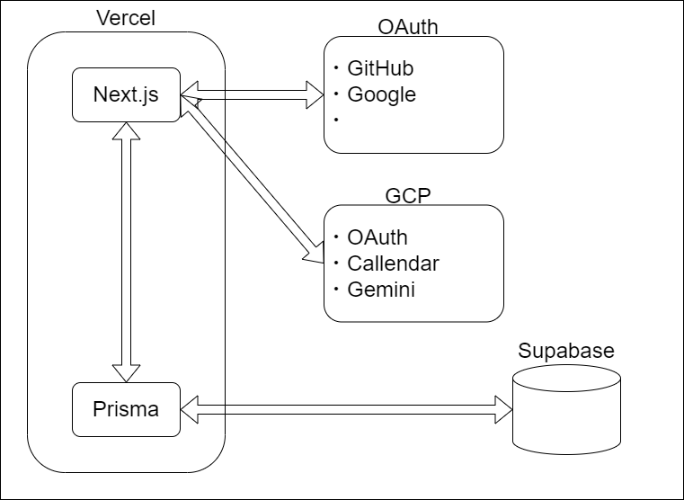
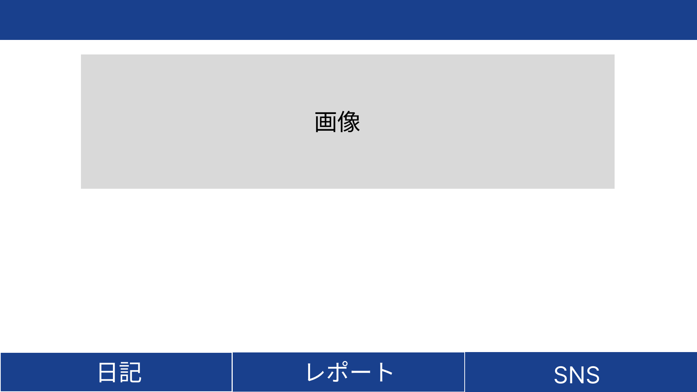
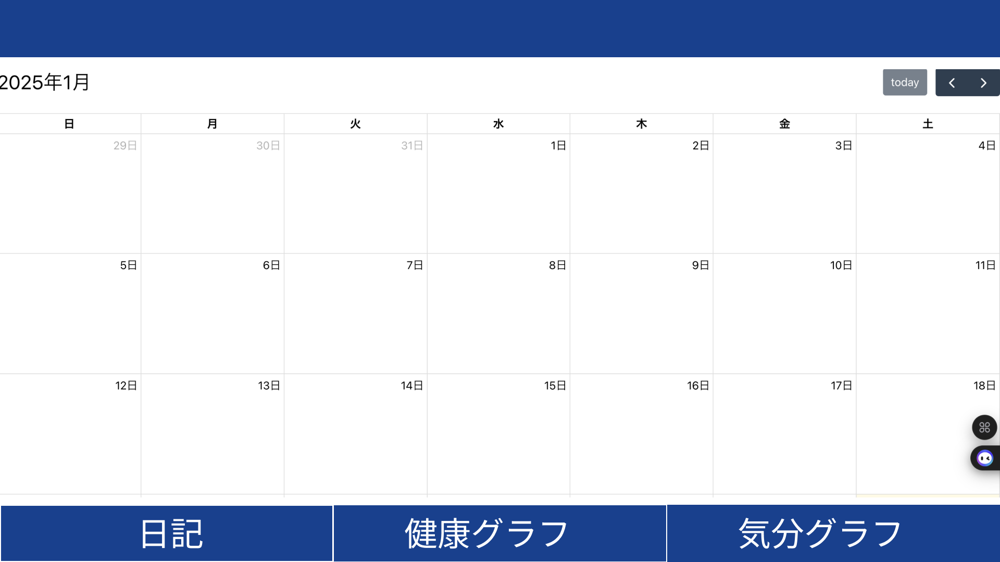
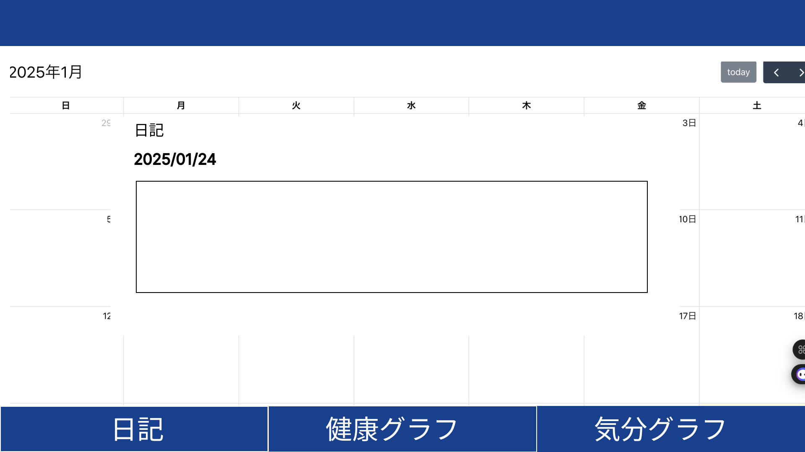

# 設計書
1. [アーキテクチャ/使用技術](#アーキテクチャ使用技術)
2. [画面仕様](#画面仕様)
   1. [ダッシュボード(ホームページ)](#ダッシュボードホームページ)
   2. [日記アプリページ](#日記アプリページ)
      1. [日記モーダル](#日記モーダル)
         1. [入力形式の選択タブ](#入力形式の選択タブ)
            1. [日記形式](#日記形式)
            2. [コラム法形式](#コラム法形式)
   3. [メンタルグラフページ](#メンタルグラフページ)
      1. [グラフ](#グラフ)
      2. [レポート](#レポート)
   4. [SNSページ](#snsページ)
   5. [ログイン画面](#ログイン画面)
3. [機能仕様](#機能仕様)
   1. [ユーザ認証](#ユーザ認証)
4. [データ管理(ER図)](#データ管理er図)
   1. [カレンダーイベント](#カレンダーイベント)
   2. [メンタルデータ](#メンタルデータ)
   3. [SNS](#sns)
   4. [ユーザデータ](#ユーザデータ)
5. [API定義書](#api定義書)
6. [データ解析について](#データ解析について)

## アーキテクチャ/使用技術

* フロントエンド
  * Next.js
* バックエンド
  * Prisma
* データベース
  * Supabase

* データ解析
  * Python
  * LLM

## 画面仕様

### ダッシュボード(ホームページ)

* 各ページを表示する

### 日記アプリページ

* カレンダーを表示する
  * 日付をクリックすると日記のモダールを表示する
    * 日記を書ける
      * タイトル(title)を入力できる
      * 内容(description)を入力できる
  * 閉じるボタンを表示する
    * 開いているモーダルを閉じる
  * 送信ボタンを表示する
    * 日記のモーダルを表示する
    * イベントデータ(eventInfo)を保存する
      * Event→{id: string(uuid), title:string, description:string, start:string(yyyy-mm-dd)}
    * イベントデータを取得する(eventInfos)
    * 開いているモーダルを閉じる
    * イベントデータをカレンダーに反映させる
  * 削除ボタンを表示する
    * 日記のモーダルを開く
    * 既存のイベントを開いたとき、イベントデータ(eventInfo)を表示する。
    * 削除ボタンを押すと、選択されたイベントデータ(eventInfo)を削除する
    * モーダルを閉じる
    * イベントデータ(eventInfos)をカレンダーに反映させる

#### 日記モーダル

##### 入力形式の選択タブ

###### 日記形式

* 日記形式の日記を表示する

###### コラム法形式

* コラム法形式の日記を表示する

### メンタルグラフページ

* グラフを表示する

#### グラフ

#### レポート

### SNSページ

* SNSページを表示する

### ログイン画面

* ログイン画面を表示する

## 機能仕様

### ユーザ認証

## データ管理(ER図)

### カレンダーイベント

### メンタルデータ

### SNS

### ユーザデータ

## API定義書

[API定義書](https://github.com/betashort/mental-health-diary-app/blob/main/design/API/api.md)

## データ解析について

