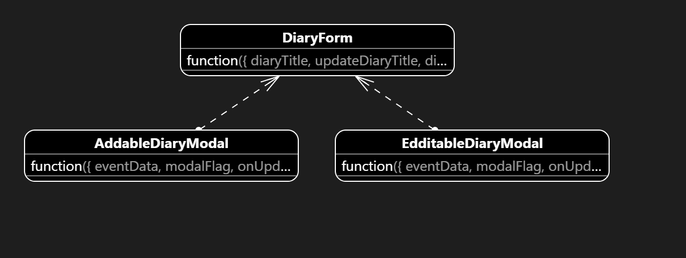
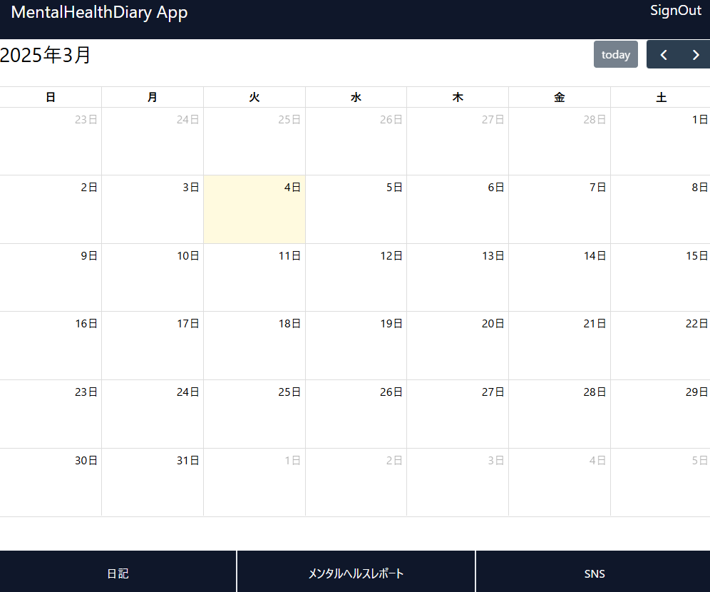
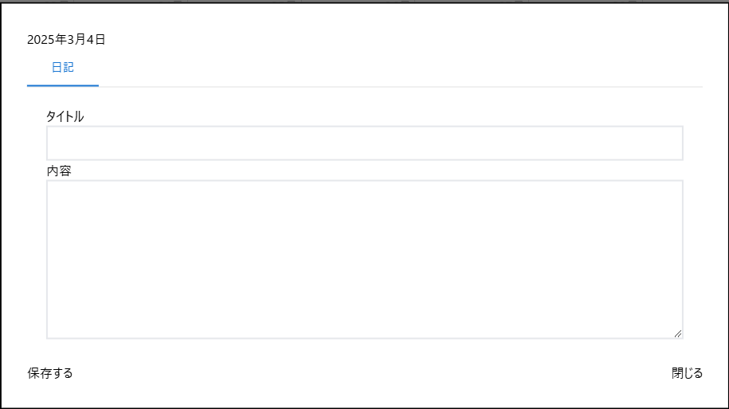
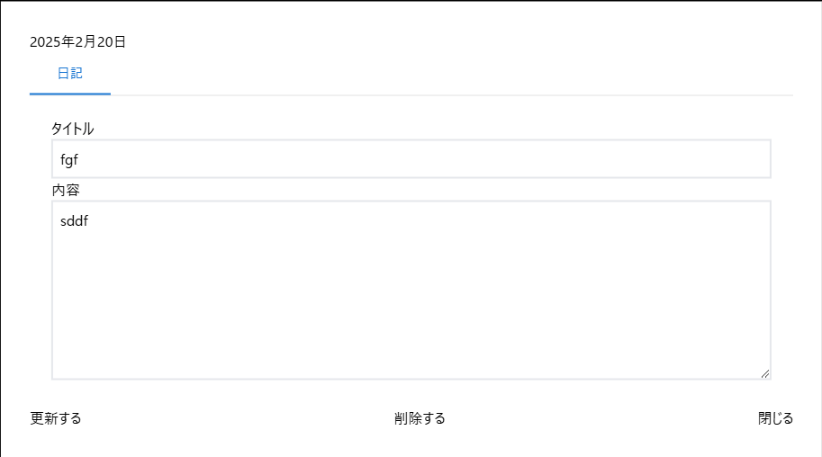

# 日記アプリページ

## 画面仕様

### カレンダーページ

### 日記モーダル

* 日記登録モーダル

* 日記閲覧モーダル

## 機能

* カレンダーを表示する
  * 日付をクリックすると日記のモダールを表示する
    * 日記を書ける
      * タイトル(title)を入力できる
      * 内容(description)を入力できる
  * 閉じるボタンを表示する
    * 開いているモーダルを閉じる
  * 送信ボタンを表示する
    * 日記のモーダルを表示する
    * イベントデータ(eventInfo)を保存する
      * Event→{id: string(uuid), title:string, description:string, start:string(yyyy-mm-dd)}
    * イベントデータを取得する(eventInfos)
    * 開いているモーダルを閉じる
    * イベントデータをカレンダーに反映させる
  * 削除ボタンを表示する
    * 日記のモーダルを開く
    * 既存のイベントを開いたとき、イベントデータ(eventInfo)を表示する。
    * 削除ボタンを押すと、選択されたイベントデータ(eventInfo)を削除する
    * モーダルを閉じる
    * イベントデータ(eventInfos)をカレンダーに反映させる

### イベント登録

### イベント閲覧

### イベント削除

## 非機能

### セキュリティ

### 性能

